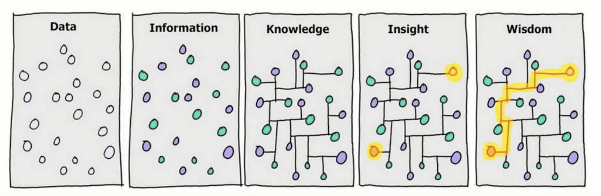

-
  #+BEGIN_NOTE
  This documentation is written by a Logseq fan and not the Logseq team. You can find the official documentation [here](https://logseq.github.io/#/page/Contents).
  #+END_NOTE
-
  #+BEGIN_TIP
  * **You have never used an [[Infinite Outliner]] application?** Feel free to play around - click on links with brackets `[[]]` (you may also hover over them!) to be taken to another section of content, hover over the [[bullet]] on the left side to expand/collapse content or click on it to open it in its own view.
  * Press `t` then `w` (like typing `tw`) to increase the page width.
  * Use the [[search]] at the top left of the screen.
  #+END_TIP
# Introduction
heading:: true
	-
	  #+BEGIN_WARNING
	  **Logseq is still in a beta phase. Regularly backup your files.**
	  Use a version history tool such as git or even cloud storage providers like Dropbox. When using git, commit your changes regularly (you may use `git diff --stat` to confirm no file has been accidentally cleared; or show changes of previous commits with `git show --stat` or `git log --stat`).
	  As content is stored as plain Markdown files, you may use any backup tool of your choice.
	  #+END_WARNING
	- ## What is Logseq?
		-
		  #+BEGIN_TIP
		  You are looking at it right now - this page was built with Logseq!
		  #+END_TIP
		- [Logseq](https://github.com/logseq/logseq) (\[lɒɡsiːk\], from _logbook sequence_) ([documentation](https://logseq.github.io/#/page/Contents)) is an alternative to knowledge management tools like [VuePress](https://vuepress.vuejs.org/guide/) or [Roam Research](https://roamresearch.com/) or even a set of Microsoft Word documents.
		- Logseq is an [[Infinite Outliner]] app for organizing knowledge - it does not work with documents but with [[pages]] and [[blocks]] that have references to each other.
		- Its core principle is a [[Graph]]-based approach where [[pages]] and [[blocks]] (sections of pages) are _linked_ to each other, which allows you to quickly see where related information is stored and how your knowledge is _connected_ - gaining new insights. By understanding how your knowledge is connected - its paths - you gain wisdom:
		  
		  Source: [OneStutteringMind](https://youtu.be/8cZdHIgwPro?t=610)
		- Logseq is built on a few fundamental features:
		  1. **You own your data:** Logseq uses plain Markdown files to store any of your content (it uses additional syntax ([example](https://discuss.logseq.com/t/headings-where-they-at/391/12)) - you will always be able to retrieve your data or look at it with any text editor. It uses an additional database it generates from your Markdown files used to store metadata.
		  1. **Privacy-first and offline access:** Your data does not leave your computer and you do not need to be online to use Logseq. It offers an optional [[Github login]] that uses a thin backend server for authentication and image upload (deprecated). You are able to encrypt your data ([[Features/Encryption]]).
		  1. **Community-driven:** The Logseq team is heavily interacting with the community by making the frontend code [open-source](https://github.com/logseq/logseq) (not the backend code) and engaging with users on [Discord](https://discord.gg/KpN4eHY) in a very transparent way ([roadmap](https://trello.com/b/8txSM12G/roadmap)).
		  1. **Free:** The current features are (and supposedly remain) free. The Logseq team is planning to introduce advanced features, such as collaboration, that may possibly be paid in order to provide for future development. **You are able to [donate](https://opencollective.com/logseq) to the team which I can only recommend.** You can also help them to improve features by allowing to send usage data and diagnostics (enable in [[Settings]], uses [sentry.io](https://sentry.io/))
		- Read more about Logseq's [[Business Model]].
	- ## Setting up Logseq
	  collapsed:: true
		- Logseq can be used in multiple ways ([further information](https://github.com/logseq/logseq/#how-can-i-use-it)):
		  1. **Standalone desktop application:** This is the most popular way of using Logseq and supports the most features as well as best performance. It can be used fully offline. It supports Windows and MacOS. It does not support GitHub online repositories.
		  1. **Browser application with GitHub login:** This allows using a GitHub account to store your content directly in a GitHub online repository as well as local storage. It allows using browser extensions such as [Greasemonkey](https://addons.mozilla.org/de/firefox/addon/greasemonkey/) or [Grammarly](https://addons.mozilla.org/de/firefox/addon/grammarly-1/?utm_source=addons.mozilla.org&utm_medium=referral&utm_content=search) and normal page-based search.
		  #+BEGIN_WARNING
		  The authentication via GitHub is going to be deprecated.
		  #+END_WARNING
		- ### Mobile
			- Logseq has a mobile application in development but it is not yet available.
			- If you host your content on GitHub, Dropbox etc. you can still access your knowledge from your mobile by opening the Markdown files directly.
			-
			  #+BEGIN_TIP
			  Always make sure to re-sync when switching devices.
			  #+END_TIP
			-
			  #+BEGIN_WARNING
			  Be careful with putting your data on the web - there had been an incident with Logseq:
			  #+BEGIN_QUOTE
			  * Why I log in with Google but somehow I can see other people's notes on GitHub?
			  * The reason is that logseq supports GitHub at the beginning, we have a GitHub username in our database as each user's identifier.
			    Later on, we added Google login, we start to use openid for the user's identifier but there's a bug that still uses username for authentication, which makes this happen.
			  * We believe this bug is fixed now, @oldjove thank you for the reporting!
			    To fix the existing data, we also removed all the Google-authenticated accounts from our database, some users might need to login again (with GitHub).
			  * We also removed login with Google, because it doesn't make any sense, there's no google drive storage support, we can already use the desktop app to open the GDrive local folder.
			  * Another thing is that we don't think the under-testing plugins API can support GitHub integration on the web in the near future, the plan is to develop the mobile app to makes it able to read and write files locally, just like the desktop app, so we can use Dropbox/GDrive/iCloud/etc for syncing our data.
			  * I'm sorry to announce that we'll deprecate the GitHub integration once the mobile app is working, as a small team we have to focus on the core editor UX and more reliable storage options.  The mobile app might be ready for testing in 1~2 months.
			  * For people who still need the GitHub integration, we will open source our existing backend code this month so that you can self-host yourself.
			  #+END_QUOTE
			  #+END_WARNING
	- ## Getting Started
	  collapsed:: true
		- See the [official Getting Started documentation](https://logseq.github.io/#/page/getting%20started)
- # General Usage
  heading:: true
  collapsed:: true
	- Keyboard Shortcuts
	  heading:: true
	  id:: 612a3629-bfa5-4d51-9d6f-fb03237c43fe
		-
		  alias:: keyboard shortcut, keyboard shortcuts
		-
		  #+BEGIN_TIP
		  Edit keyboard shortcuts via _[[Settings]] > Customize shortcuts_ or by editing the `:shortcuts` section in the [[config.edn]] file (requires restarting or [[reindexing]] your [[graph]]).
		  #+END_TIP
		-
		  #+BEGIN_NOTE
		  **How to read keyboard shortcuts:**
		  * `a+b` Press both the `a` and `b` key at the same time
		  * `a b` Press the `a` key first, let it go and then press the `b` key
		  * `a+b/c` Press both the `a` and `b` or `a` and `c` key at the same time
		  #+END_NOTE
		- `Esc` to leave editing mode and enter [[non-edit mode]] in order to highlight multiple blocks via mouse drag, drag & drop blocks and more
		  #+BEGIN_TIP
		  * Press `up/down` after entering [[non-edit mode]] to select your blocks. If you reached the end of your page, you will continue in the sidebar.
		  * Focus a block first before pressing `Esc` to place the focus on your current block.
		  #+END_TIP
		- Block Management
			- `t o` Collapse/expand block (put cursor into/highest block level or click left/right of document to collapse/expand all (can be used multiple times)
			- `cmd+up/down` Collapse/expand all blocks (can be used multiple times)
			- [#A] `cmd./,` Zoom into/out of block, press `Esc` (switch to View Mode) to make it behave as back/forward buttons
			- `cmd+shift+a` Select all blocks (cursor must have focus) - use `cmd+up/down` to select multiple blocks from your current cursor position
			- [#A] `alt+drag` on block to copy the reference to a block - very handy!
			- [#A] `cmd+shift+r` to replace a block reference with its text (under cursor). Helps you to drag info out of other pages, then bring everything into one clean document without having to copy and paste text
			- ~~`ctrl+x` Delete current block (like `cmd+x` in text editors but without copying)~~
			- [#A] `cmd+c` (do not highlight anything, simply put cursor into line) copy current block's reference id so you can quickly paste it as a block reference
			  id:: 6106aeb1-42c7-4eae-9614-ed70a0aa3cad
				- Alternatively use `right-click > copy block reference` on a block
			- `cmd+shift+up/down` Move block (note: only works on same indentation level)
		- Text Management
			- `cmd+shift+v` Paste multi-paragraph text in clipboard as one block instead of multiple (i.e. paste plain text)
			- `t e` enable using `Return` to insert newline (like normally `shift-return` does) so you can more easily enter e.g. new list items (a `A` will appear as indicator on top toolbar) - handy
		- Navigation
		  id:: 60f48a7d-9870-4b48-9bb1-95c99ae2f265
			- [#A] `cmd+o` when focus is within square brackets to open page in the sidebar
			- [#A] `shift+click` or `cmd+shift+o` when focus is within square brackets to open a page in the sidebar (also works for search results!)
			- `g h` to go to your start page ( <ins>g</ins>o <ins>h</ins>ome)
			-
			  :TEST:
			  Test
			  :END:
			-
		- User Interface
			- `t w` Toggle <ins>w</ins>ide mode
			- `t r` Toggle <ins>r</ins>ight sidebar
			- `t f` Toggle contents (i.e. <ins>f</ins>avorites) in sidebar
			- `t s` Toggle <ins>s</ins>ettings
			- `t t` Toggle <ins>t</ins>heme (dark/light)
			- `t d` Toggle [[Document Mode]]
			- `?` Toggle help
			- `cmd+c b` Show hide brackets around links
		- Task Management
			- `cmd+enter` Change todo status (works for single line only)
		- [[Search]]
			- `cmd+u` Search all pages/create page
			- `cmd+shift+u` Search in current page
		- Version Management
			- `c` Create new version (<ins>c</ins>ommit) of file
			- `Cmd!+/Alt+!` Execute custom Git command
		- Other
			- `alt+click` on file link to open in native application (e.g. PDF for fullscreen)
			- `cmd-c cmd-s` to rebuild the search index without refreshing the browser
	- ## Journal vs. Pages
	  collapsed:: true
		- The _[[Journal]]_ is for micro inputs (e.g. short articles, tweets, random thoughts, TODOs, note from irregular calls) ([OneStutteringMind](https://www.youtube.com/channel/UCz7EgrAosr5FRF3IErGV-yQ))
			- Entered frequently
			- Bite-sized information
			- Unstructured
			- Stream of consciousnes (fleeting)
		- _Pages_ are for macro inputs (e.g. long articles. notes from regular calls and processed information) ([OneStutteringMind](https://www.youtube.com/channel/UCz7EgrAosr5FRF3IErGV-yQ))
			- Entered infrequently
			- Dense information
			- Structured
			- Processed thoughts (permanent)
	- ## Working with Blocks
	  collapsed:: true
		- if you cannot delete an empty block, make sure it has no indented children - if it has, first outdent them to the same level as the empty line you want to delete
	- ## Organizing Your Knowledge
	  collapsed:: true
		- ### [[Namespaces]]
		- ### [[Favorites]]
	- ## Writing Good Notes
	  collapsed:: true
		- Use [[Namespaces]] to organize your [[pages]] and [[tags]] to classify [[pages]] or [[blocks]].
		- Use [[Properties]] to add additional classification and easily query your knowledge.
		- Leverage [[Unlinked References]] to avoid having to tag everything.
		- Use [[Aliases]] to make sure your content is linked properly throughout your library.
		- Use tools like [diigo](https://www.diigo.com/index), [memex](https://getmemex.com/) ([video](https://www.youtube.com/watch?v=G8UF8lQnAKA&t=171s)), or even [todoist](https://todoist.com) to bookmark/highlight/annotate/outline t you found on the web
		- Example - You have recurring meetings with your bank to discuss the possibility of buying a house.
		- Recurring Meetings
			- You create a page `Private/House/Bank` and tag it with `#finance`.
			- You do not want to copy & paste repeating items that are discussed in multiple meetings - this would be an additional effort and you risk having slightly different versions of the same.
				- Option 1: Just reference a [[block]] in every meeting and then click on it to go to the actual content
				- Option 2: Use an embedded [[block]], then keep updating it so you always have the latest information directly available
				- For the next meeting, copy the previous one and put reference to any items that just appeared in previous meeting. If no longer needed, remove from new meeting
				- The disadvantage is that you lose _history_ i.e. you will not easily see how a certain item developed over multiple meetings (you just see the latest status).
					- When using a local Git repository, you can go back in time.
	- ## Emojis
	  collapsed:: true
		- You can work with Emojis in Logseq - there are different options:
			-
			  1. Native OS emoji picker - `Cmd+Ctrl+Space` for Mac, `Windows+.` for Windows
			  1. [Emoji picker](http://www.unicode.org/emoji/charts/full-emoji-list.html) [[plugin]] in Logseq
			  1. Copy and paste from [Unicode emoji overview](http://www.unicode.org/emoji/charts/full-emoji-list.html)
	- ## Importing Markdown
	  collapsed:: true
		- Simply save the `.md` file in your Logseq [[Graph]] folder (sometimes you need to [[reindex]]).
		- You may also update a `.md` file directly in any other editor - it will refresh in Logseq after a few seconds
		-
		  #+BEGIN_WARNING
		  Markdown lists are only imported as blocks if prefixed with`-` instead of `*`.
		  #+END_WARNING
	- ## Prevent Pasted Text from being Automatically Formatted
	  collapsed:: true
		- Text you copy and paste in Logseq will retain its block structure and formatting - you can use `cmd+shift+v` or type ` twice and put the pasted content in-between to prevent that
	- ## Performance
		- Logseq is generally performant, but certain situations can lead to slowness:
		  id:: 6109951e-1c4d-4491-8147-9c4072672d56
			-
			  1. Long pages with many blocks (more than 500) - try to add references to other blocks/pages instead of putting all the content on the same page
			  2. Slow queries in the [[config.edn]][^1] (are always executed) or opened pages
			  3. Many source code blocks 
			  [^1]: A workaround is to put the queries into a separate page and a link to it in the [[Favorites]] pane.
			-
			  #+BEGIN_TIP
			  Queries part of collapsed blocks will not be automatically executed. (Use the Developer Tools to confirm the raw Datalog queries)
			  #+END_TIP
- Features
  heading:: true
	- Logseq offers your typical word processing features such as formatting text, adding images or links with the added touch of functionality found in [[Infinite Outliners]].
	- The following information is intended to both introduce you to features and to show you how to use them in Logseq.
	- ## Text Editing - your bread and butter
		- ## [[Formatting]]
		- ## [[Tables]]
		- ## [[Footnotes]]
		- ## [[HTML]]
		- ## [[Comments]] (invisible text)
	- ## Graphs, References and Aliases - your home and friends
		- ## [[Graphs]]
		- ## [[References]] - [[Pages]], [[Blocks]] and [[Tags]]
		- ## [[Aliases]]
	- ## Non-textual information
		- ## [[Files]] and [[Images]]
	- ## Advanced Features
		- ## [[Components]]
		- ## [[Commands]]
		- ## [[Properties]]
		- ## [[Templates]]
		- ## [[Macros]]
		- ## [[Dynamic Variables]]
		- ## [[Task Management]]
		- ## [[Spaced Repetition]] (Flashcards)
		- ## [[PDF Annotations]]
		- ## [[Encryption]]
		- ## Querying Data ([[Queries]])
		- ## [[Page Version History]]
		- ## Customization: [[Custom CSS]] & [[Plugins API]]
			- To change the _appearance_ of Logseq you can add your own [CSS](https://en.wikipedia.org/wiki/CSS) rules. These are defined in Logseq's [[custom CSS]] file.
			- To change the _functionality_ of Logseq you can write your own plugin via the [[Plugins API]].
		- ## Community Features
		  collapsed:: true
			- Check [Awesome Logseq](https://github.com/logseq/awesome-logseq) for features contributed by the community - either themes or layout features ([[Custom CSS]]) or plugins to provide additional functionality ([[Plugins API]])
		- ## Deprecated Features
		  collapsed:: true
			- The following features are no longer available.
			- ## Timestamps
				- Timestamps allowed you to log the date you created or last modified a block. This worked by adding additional metadata to your Markdown file - the date and the block's Id - (initially they were stored in Logseq's database), which was hidden when viewing the file in Logseq. This feature has been deprecated as it proved to be prone to issues.
- # Development
  collapsed:: true
	- To contribute to Logseq, clone the [git repository](https://github.com/logseq/logseq/), `cd logseq`, `yarn install`, `yarn watch` (check log output - it lists multiple IPs/addresses to open)
		-
		  #+BEGIN_TIP
		  If the Logseq page stays blank, open the dashboard URL (e.g. `http://localhost:9630/dashboard`) and click on `Force recompile` for the Electron app
		  #+END_TIP
	- ## [[Plugins API]]
	- ## [[Static Export]]
	- ## [[Logseq Publish]]
- # Logseq vs. Similar Apps
  collapsed:: true
	- See [[Infinite Outliners]]
	- ## VuePress
		- Advantages
			- Block-based
			- Better search (fuzzy match - even though it is available for VuePress, it is not when using your IDE to write)
			- WYSIWYG - when using VuePress, you typically spend 95% in the IDE instead of your beautiful VuePress page
			- Easier navigation - while you still need to specify a hierarchy of files, any headings part of the file are displayed automatically
		- Disadvantages
		  heading:: true
			- High CPU usage due to Electron and TailwindCSS server
			- No table of headings ([outline](https://discuss.logseq.com/t/outline-overview-for-sidebar/740)) per page, makes it challenging to navigate
			- Based on Clojure/ClojureScript instead of JavaScript (Clojure is based on Lisp, which uses mainly lists as elements)
			- No support for Vue-like components that allow easy customization, such as a `<Link>` component
			- Has still many bugs that sometimes cause loss of content
			- Shortcuts for text management are limited compared to an IDE like VS Code (moving lines, quickly cutting lines, manipulating multiple lines etc.)
	- ## Obsidian
		-
		  #+BEGIN_TIP
		  You can combine Obsidian and Logseq to get best-of-breed tools! Whenever you update content in Logseq it will directly reflect in Obsidian (or vice versa)
		  #+END_TIP
		- See [here](https://discuss.logseq.com/t/making-obsidian-play-nice-with-logseq/1185) for tips
		- Advantages
			- Obsidian is better for writing long notes (for example, it can list all headings on a page for easier navigation)
			- Obsidian supports many more plugins (hundreds!)
			- Many more features, e.g. show all tasks or the number of notes, the outline of a document, bookmarking pages, quick switch (instead of Logseq search wich does both, but gets bloated)
			- Better search capabilities
		- Disadvantages
			- Obsidian is not block-based - i.e. you cannot reference a single paragraph or collapse headings (however, this also makes it more portable as closer to basic Markdown files). The block-based alternative from the same developers is [Dynalist](https://dynalist.io/pricing) which was actually available before Obsidian. However, it comes with a price tag.
			-
			  #+BEGIN_TIP
			  There are plugins like Obidian Outliner or Obsidian Zoom that allow a more outliner-based approach.
			  #+END_TIP
			- No WYSIWYG - Markdown code and output are separated into different panes unlike Logseq where you immediately see the result
		- Disadvantages of using in parallel with Logseq
			- Logseq/Obsidian-specific features like block references will not be parsed
			- Adds an additional attack vendor for your sensitive information
- # Errors
  collapsed:: true
	- Page is empty or does not show most recent content
		- This is typically only a visual issue and your content is not lost. Confirm it by opening the Markdown file in a text editor
		- To resolve
			- Create a backup of your [[graph]] folder, then
			-
			  1. [[Reindex]] your [[graph]], or
			  1. Restart Logseq, or
			  1. Go to _[[Settings]] > Clear [[Cache]]_ or use `Cmd+Shift+R` to reload without cache (you will need to restore your settings)
		- Another reason is that the reference does not link to the correct file - for example, you have a file `2021_01_01.md` but link to it via `[[2021-01-01]]` (note the dashes - and rename the file)
		- If you use the desktop application and force quit it instead of closing it properly, the content displayed when opening it again may not reflect the actual content. Logseq saves its [[graph]] database (the meta information about your files) only when being properly closed. However, no actual content is lost. [[Reindex]] your content to make it appear again.
- # Resources
  heading:: true
  collapsed:: true
	- DOING Go through official Logseq changelog
	- TODO Go through [OneStutteringMind](https://www.youtube.com/channel/UCz7EgrAosr5FRF3IErGV-yQ)'s resources
	- [Awesome Logseq](https://github.com/logseq/awesome-logseq)
	- [Migrating from Roam Research](https://discuss.logseq.com/t/tips-for-former-roam-users/1228)
	- [Great videos around](https://www.youtube.com/channel/UC525q2RIufHjnaHOuIUFY9A) [[PKM]]
		- [Learn anything fast with Roam](https://www.youtube.com/watch?v=df-Pufz0OBc)
	- Introduction videos: [1](https://www.youtube.com/watch?v=Vw-x7yTTO0s&t=496s), [2](https://www.youtube.com/watch?v=43PKm0TfyNk), [3](https://www.youtube.com/watch?v=43PKm0TfyNk), [4](https://www.youtube.com/watch?v=280hiGGM1Yg)
# [[Contributing]] to This Documentation