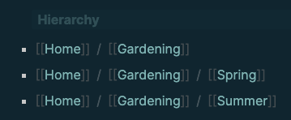

- Namespaces are used to create hierarchies of information.
- **USAGE**
	- Namespaces are created whenever you include a `/` in your page
	- They allow you to organize knowledges, reuse general page titles and simplify searches by restricting until a certain level in the hierarchy.
- **EXAMPLE**
	- Creating two pages named [[Home/Gardening/Spring]] and [[Home/Gardening/Summer]] will allow you to
		- organize your knowledge in a hierarchy - `Gardening` is an activity you do at `Home` and both during `Spring` and `Summer`
		- use the general titles `Spring` and `Summer` for other information such as [[Vacation/Summer]] without both being treated as the same topic
		-
		  #+BEGIN_WARNING
		  Namespaces will make [[Unlinked References]] less useful: If you were to write "The summer was fantastic for gardening!" this reference would not appear on the [[Home/Gardening/Summer]] page unless you wrote for example "The summer was fantastic for gardening!  #Home/Gardening/Summer".
		  #+END_WARNING
	- The page above will result in three separate pages: [[Home]], [[Home/Gardening]], [[Home/Gardening/Spring]] and [[Home/Gardening/Summer]]
	- You can access the hierarchy at the bottom of a page:
	  
		-
		  #+BEGIN_NOTE
		  Order of the hierarchy entries is not guaranteed and cannot be influenced.
		  #+END_NOTE