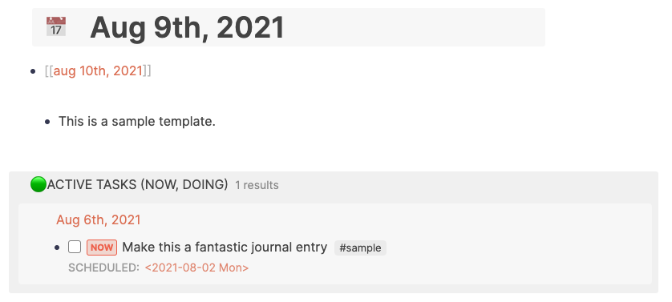

- Advanced queries allow you to specify more detailed, more specific and explicitly formatted queries compared to [[Queries/Simple Queries]].
-
  #+BEGIN_NOTE
  If you are just getting started, check out the [tutorial for Advanced Queries]([[Queries/Advanced Queries/Tutorial]]) that walks you through line-by-line.
  #+END_NOTE
-
  #+BEGIN_TIP
  Get familiar with [Logseq's database schema](https://github.com/logseq/logseq/blob/master/src/main/frontend/db_schema.cljs).
  #+END_TIP
- ## How to Write Advanced Queries
	- Advanced queries are written via [[Datalog]]
	- Advanced queries can get complex, but their format is always the same:
	  ```
	  {:title  [:strong "<Your query title with optional formatting>"]
	   :query  [:find (pull ?b [*])
	          :where <Your query filter>]
	   :inputs [<Your query input>]
	   :view             (fn [query-result] [:div <Your query result layout>])
	   :result-transform (fn [query-result] <Your query transformation>)
	   :collapsed? true
	   <Your additional query toggles>
	  }
	  ```
	-
	  |Name|Description|Default|Optional|
	  |`title`|Query title, supports [hiccup](((610afd9a-4c78-4099-a333-82dddbddf008))) ||`true`|
	  |`query`|Datascript query||`false`|
	  |`inputs`|Query inputs||`true`|
	  |`view`|`(fn [query-result] <hiccup>)`||`true`|
	  |`result-transform`|`(fn [query-result] <do something>)`||`true`|
	  |`collapsed?`|Whether to collapse the result|`false`|`true`|
	  |`:breadcrumb-show?`|Whether to show the breadcrumb path|`false`|`true`|
	  [Source](https://logseq.github.io/#/page/advanced%20queries)
	-
	  #+BEGIN_TIP
	  You can also write simple queries with advanced query syntax: `{:title "My query" :query (todo todo done)}`
	  #+END_TIP
- ## Query Toggles
	- There are certain properties that allow you to control the output of advanced queries.
	- **USAGE**
		- `:collapsed?` determines whether the query results are collapsed (`true`) or expanded (`false`) by default
		- `:breadcrumb-show?` determines whether to show breadcrumbs in a query result (i.e. the path to the block)
	- **EXAMPLES**
		- This is #myTagA
		-
		  #+BEGIN_QUERY
		  {:title "A collapsed query"
		  :query [:find (pull ?b [*])
		  	       :where
		  	       [?p :block/name "mytaga"]
		  	       [?b :block/ref-pages ?p]]
		  	  :collapsed? true}
		  #+END_QUERY
			-
			  ```clojure
			  #+BEGIN_QUERY
			  {:query [:find (pull ?b [*])
			  	       :where
			  	       [?p :block/name "mytaga"]
			  	       [?b :block/ref-pages ?p]]
			  	  :collapsed? true}
			  #+END_QUERY
			  ```
		-
		  #+BEGIN_QUERY
		  {:title "A query without breadcrumbs"
		  :query [:find (pull ?b [*])
		  	       :where
		  	       [?p :block/name "mytaga"]
		  	       [?b :block/ref-pages ?p]]
		  	  :breadcrumb-show? false}
		  #+END_QUERY
			-
			  ```clojure
			  collapsed:: true
			  #+BEGIN_QUERY
			  {:title "A query without breadcrumbs"
			  :query [:find (pull ?b [*])
			  	       :where
			  	       [?p :block/name "mytaga"]
			  	       [?b :block/ref-pages ?p]]
			  	  :breadcrumb-show? false}
			  #+END_QUERY
			  ```
		-
		  #+BEGIN_QUERY
		  {:title "A query with breadcrumbs"
		  :query [:find (pull ?b [*])
		  	       :where
		  	       [?p :block/name "mytaga"]
		  	       [?b :block/ref-pages ?p]]
		  	  :breadcrumb-show? true}
		  #+END_QUERY
			-
			  ```clojure
			  #+BEGIN_QUERY
			  {:title "A query with breadcrumbs"
			  :query [:find (pull ?b [*])
			  	       :where
			  	       [?p :block/name "mytaga"]
			  	       [?b :block/ref-pages ?p]]
			  	  :breadcrumb-show? true}
			  #+END_QUERY
			  ```
- ## Formatting Queries
	- TODO Add content
	- ### Query Titles
		- You can name your queries by defining a title. Titles can receive different formatting.
		- **EXAMPLES**
			- Bold text (and plain text)
				-
				  #+BEGIN_QUERY
				  {:title [["All pages that have a "] [:strong "myTagA"] [" tag"]] }
				  #+END_QUERY
				-
				  ```clojure
				  #+BEGIN_QUERY
				  {:title [["All pages that have a "] [:strong "myTagA"] [" tag"]] }
				  #+END_QUERY
				  ```
			- Text styled as a heading
				-
				  #+BEGIN_QUERY
				  {:title [:h3 "My pages"] }
				  #+END_QUERY
				-
				  ```clojure
				  #+BEGIN_QUERY
				  {:title [:h3 "My pages"] }
				  #+END_QUERY
				  ```
## Sorting Results
	- TODO Add content
	- You can use the `sort-by` function to sort results.
	- NOW  Test
	  id:: 612ca503-57db-4264-bfcc-7d49e65b288c
	  SCHEDULED: <2021-08-03 Tue>
	- Sort by priority
	  query-table:: true
	  SCHEDULED: <2021-08-11 Wed>
	  #+BEGIN_QUERY
	        {:title "🟢 ACTIVE"
	          :query [:find (pull ?h [*])
	                  :in $ ?start ?today
	                  :where
	                  [?h :block/marker ?marker]
	                  [?h :block/page ?p]
	                  [(>= ?d ?start)]
	                  [(<= ?d ?today)]
	                  [(contains? #{"NOW" "DOING"} ?marker)]]
	          :inputs [:14d :today]
	          :result-transform (fn [result]
	                              (sort-by (fn [h]
	                                         (get h :block/priority "Z")) result))
	          :collapsed? false}
	  #+END_QUERY
## Regular Expressions
	- You can use regular expressions (RegEx) for matching:
	-
	  #+BEGIN_QUERY
	  {:title "All pages starting with 'Queries'"
	   :query [:find (pull ?b [*])
	         :where
	         [?b :page/name ?name]
	         [(str "Queries.*") ?regs]
	         [(re-pattern ?regs) ?regx]
	         [(re-matches ?regx ?name)]]
	  }
	  #+END_QUERY
	-
	  ```clojure
	  #+BEGIN_QUERY
	  {:title "All pages starting with 'Queries'"
	   :query [:find (pull ?b [*])
	         :where
	         [?b :page/name ?name]
	         [(str "Queries.*") ?regs]
	         [(re-pattern ?regs) ?regx]
	         [(re-matches ?regx ?name)]]
	  }
	  #+END_QUERY
	  ```
## Examples
	- ### Tags
	  collapsed:: true
		-
		  #+BEGIN_QUERY
		  {:title "All pages with tag myPageTag"
		   :query [:find (pull ?b [*])
		       :where
		       [?p :page/name "mytagtag"]
		       [?b :block/ref-pages ?p]]
		  :collapsed? true}
		  #+END_QUERY
			-
			  ```clojure
			  collapsed:: true
			  #+BEGIN_QUERY
			  {:title "All pages with tag myPageTag"
			   :query [:find (pull ?b [*])
			       :where
			       [?p :page/name "mytagtag"]
			       [?b :block/ref-pages ?p]]
			  :collapsed? true}
			  #+END_QUERY
			  ```
		-
		  #+BEGIN_QUERY
		  {:title "All pages that have a myPageTag tag"
		   :query [:find ?name
		         :in $ ?tag
		         :where
		         [?t :block/name ?tag]
		         [?p :page/tags ?t]
		         [?p :block/name ?name]]
		   :inputs ["mytagtag"]
		   :view (fn [result]
		         [:div.flex.flex-col
		          (for [page result]
		            [:a {:href (str "/page/" page)} (clojure.string/capitalize page)])])}
		  #+END_QUERY
			-
			  #+BEGIN_NOTE
			  This query returns manually generated links - the navigation will be different than what you are used to in Logseq (not recommended for Desktop app).
			  #+END_NOTE
	- ### Tasks
	  collapsed:: true
		- Querying all `NOW` tasks
			-
			  #+BEGIN_QUERY
			  {:title "🔨 NOW"
			      :query         [:find (pull ?h [*])
			                        :in $ ?start ?today
			                        :where
			                        [?h :block/marker ?marker]
			                        [(contains? #{"TODO" "NOW" "DOING"} ?marker)]
			                        [?h :block/page ?p]
			                        [?p :block/journal? true]
			                        [?p :block/journal-day ?d]
			                        [(>= ?d ?start)]
			                        [(<= ?d ?today)]]
			      :inputs        [:14d :today]
			      :result-transform (fn [result]
			                          (sort-by (fn [h]
			                              (get h :block/priority "Z")) result))
			      :collapsed? false}
			  #+END_QUERY
			-
			  ```clojure
			  {:title            "🔨 NOW"
			      :query            [:find (pull ?h [*])
			                         :in $ ?start ?today
			                         :where
			                         [?h :block/marker ?marker]
			                         [(contains? #{"NOW" "DOING"} ?marker)]
			                         [?h :block/page ?p]
			                         [?p :block/journal? true]
			                         [?p :block/journal-day ?d]
			                         [(>= ?d ?start)]
			                         [(<= ?d ?today)]]
			      :inputs           [:14d :today]
			      :result-transform (fn [result]
			                          (sort-by (fn [h]
			                                     (get h :block/priority "Z")) result))
			      :collapsed?       false}
			  
			  {:title      "📅 NEXT"
			      :query      [:find (pull ?h [*])
			                   :in $ ?start ?next
			                   :where
			                   [?h :block/marker ?marker]
			                   [(contains? #{"NOW" "LATER" "TODO"} ?marker)]
			                   [?h :block/ref-pages ?p]
			                   [?p :block/journal? true]
			                   [?p :block/journal-day ?d]
			                   [(> ?d ?start)]
			                   [(< ?d ?next)]]
			      :inputs     [:today :7d-after]
			      :collapsed? false}
			  ```
	- ### [[Hierarchies]]
		- Query all pages part of a hierarchy
		  updated-at:: 1626301594584
		  created-at:: 1626301594584
			-
			  #+BEGIN_QUERY
			  {:title "All pages that start with Home/Gardening"
			   :query [:find (pull ?p [*])
			           :where
			           [?p :block/name ?name]
			           [(clojure.string/starts-with? ?name "home/gardening")]
			  ]}
			  #+END_QUERY
			-
			  ``` clojure
			  #+BEGIN_QUERY
			  {:title "All pages that start with Home/Gardening"
			   :query [:find (pull ?p [*])
			           :where
			           [?p :block/name ?name]
			           [(clojure.string/starts-with? ?name "home/gardening")]
			  ]}
			  #+END_QUERY
			  ```
			- Alternative
			  updated-at:: 1626301589734
			  created-at:: 1626301588472
				-
				  #+BEGIN_QUERY
				  {:title "Home/Garden child pages"
				   :query [:find (pull ?p [*])
				           :where
				           [?p :block/namespace ?namespace]
				           [?namespace :block/name "home/gardening"]]}
				  #+END_QUERY
				-
				  ```clojure
				  #+BEGIN_QUERY
				  {:title "Home/Garden child pages"
				   :query [:find (pull ?p [*])
				           :where
				           [?p :block/namespace ?namespace]
				           [?namespace :block/name "home/gardening"]]}
				  #+END_QUERY
				  ```
		- Query all tasks part of a hierarchy
			-
			  #+BEGIN_QUERY
			  {:query [:find (pull ?b [*])
			           :in $ ?s
			           :where
			           [?b :block/marker "TODO"]
			           [?b :block/page ?p]
			           [?p :block/original-name ?n]
			           [(clojure.string/starts-with? ?n ?s)]]
			   :inputs [ "Home/Gardening/" ]
			   }
			  #+END_QUERY
			-
			  ```clojure
			  #+BEGIN_QUERY
			  {:query [:find (pull ?b [*])
			           :in $ ?s
			           :where
			           [?b :block/marker "TODO"]
			           [?b :block/page ?p]
			           [?p :block/original-name ?n]
			           [(clojure.string/starts-with? ?n ?s)]]
			   :inputs [ "Home/Gardening/" ]
			   }
			  #+END_QUERY
			  ```
	- ### Journal Queries
	  id:: 6110fe96-79ce-4818-b790-79cf5e7c81d8
		- You may add the following queries to your `:default-queries` section in [[config.edn]]. They are going to be displayed on today's journal entry.
		- **USAGE**
			-
			  ```clojure
			  {:title            "🔨 CURRENT TASKS (NOW)"
			      :query            [:find (pull ?h [*])
			                         :in $ ?start ?today
			                         :where
			                         [?h :block/marker ?marker]
			                         [(contains? #{"NOW" "DOING"} ?marker)]
			                         [?h :block/page ?p]
			                         [?p :block/journal? true]
			                         [?p :block/journal-day ?d]
			                         [(>= ?d ?start)]
			                         [(<= ?d ?today)]]
			      :inputs           [:14d :today]
			      :result-transform (fn [result]
			                          (sort-by (fn [h]
			                                     (get h :block/priority "Z")) result))
			      :collapsed?       false}
			  ```
			-
			  ```clojure
			  {:title      "📅 NEXT TASKS (NOW, LATER, TODO)"
			      :query      [:find (pull ?h [*])
			                   :in $ ?start ?next
			                   :where
			                   [?h :block/marker ?marker]
			                   [(contains? #{"NOW" "LATER" "TODO"} ?marker)]
			                   [?h :block/ref-pages ?p]
			                   [?p :block/journal? true]
			                   [?p :block/journal-day ?d]
			                   [(> ?d ?start)]
			                   [(< ?d ?next)]]
			      :inputs     [:today :7d-after]
			      :collapsed? false}
			  ```
			-
			  ```clojure
			  {:title "🟢 ACTIVE TASKS (NOW, DOING)"
			            :query [:find (pull ?h [*])
			                    :in $ ?start ?today
			                    :where
			                    [?h :block/marker ?marker]
			                    [?h :block/page ?p]
			                    [?p :page/journal? true]
			                    [?p :page/journal-day ?d]
			                    [(>= ?d ?start)]
			                    [(<= ?d ?today)]
			                    [(contains? #{"NOW" "DOING"} ?marker)]]
			            :inputs [:14d :today]
			            :result-transform (fn [result]
			                                (sort-by (fn [h]
			                                   (get h :block/priority "Z")) result))
			            :collapsed? false}
			  ```
		- **EXAMPLES**
			- 
## Resources
	- [Documentation](https://logseq.github.io/page/Queries#/page/advanced%20queries)