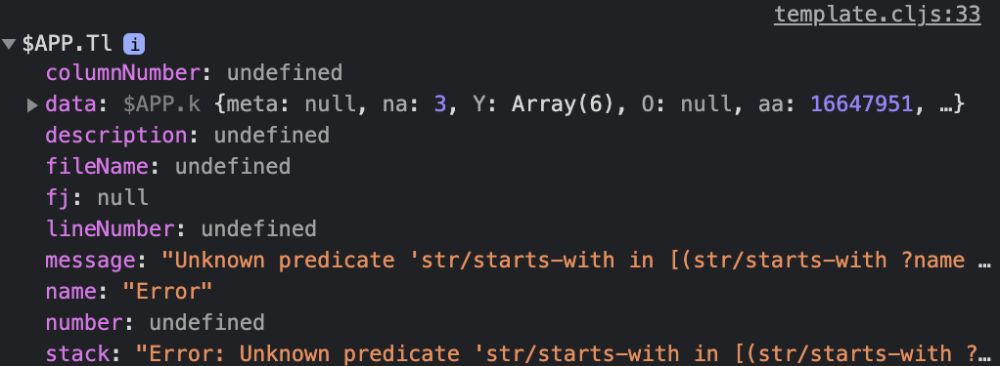

- Queries are used to _ask questions_ to your knowledge content. You can query for [[pages]], [[blocks]], [[tags]], [[tasks]] and more.
- There are two types of queries: [[Queries/Simple Queries]] and [[Queries/Advanced Queries]] .
-
  #+BEGIN_TIP
  Whenever your queries do not seem to return the right result, you can debug them and check for syntax errors - open the _Developer Tools_ in your browser, go to the _Console_ tab and look for `$APP.Tl` (click on it)
  {:height 280, :width 464}
  #+END_TIP
-
- TODO ==Anything below is work in progress!==
- Advanced queries
	-
	  ```clojure
	  #+BEGIN_QUERY
	  {:title "All pages with tag myTagA"
	   :query [:find (pull ?b [*])
	       :where
	       [?p :page/name "myTagA"]
	       [?b :block/ref-pages ?p]]
	  :collapsed? true}
	  #+END_QUERY
	  ```
	- ?p = short for ?page, ?b = short for ?block but imo random names
	- (not sure if true)`:block/name` is the block's name; note that there is [no `:page/name`](https://github.com/logseq/logseq/blob/master/src/main/frontend/db_schema.cljs) - a page is simply a special block
	-
	  created-at:: 1626300859256
	  updated-at:: 1626300859256
	  #+BEGIN_QUERY
	  {:query [:find (pull ?b [*])
	       :where
	       [?p :block/name "praise"]
	       [?b :block/ref-pages ?p]]
	  :collapsed? true}
	  #+END_QUERY
	- TODO Describe how titles are used
	  ```clojure
	  #+BEGIN_QUERY
	      {:title [:h2 "My books"]
	        :query [...]}
	      #+END_QUERY
	  ```
	- Query all pages part of a hierarchy
	  updated-at:: 1626301594584
	  created-at:: 1626301594584
	  #+BEGIN_QUERY
	  {:title "All pages starts with Home/Garden"
	   :query [:find (pull ?p [*])
	           :where
	           [?p :block/name ?name]
	           [(str/starts-with (?name) "Home/Garden")]
	  ]}
	  #+END_QUERY
		- Alternative
		  updated-at:: 1626301589734
		  created-at:: 1626301588472
		-
		  #+BEGIN_QUERY
		  {:title "Home/Garden children pages"
		   :query [:find (pull ?p [*])
		           :where
		           [?p :block/namespace ?namespace]
		           [?namespace :block/name "Home/Garden"]]}
		  #+END_QUERY
	- <page_name> <keyword 1>, without <keyword 2> OR ["page" "keyword" "not this keyword"]
	  #+BEGIN_QUERY
	  {:query [:find (pull ?b [*])
	           :in $ ?pagename ?keyword ?not
	           :where
	           [(str "(?i)" ?keyword) ?matcher1]
	           [(re-pattern ?matcher1) ?regex1]
	           [(str "(?i)" ?not) ?matcher2]
	           [(re-pattern ?matcher2) ?regex2]
	           [?p :block/original-name ?pagename]
	           [?b :block/page ?p]
	           [?b :block/content ?c]
	           (not [(re-find ?regex2 ?c)])
	           [(re-find ?regex1 ?c)]]
	   :inputs ["page" "keyword" "not this keyword"]
	   }
	  #+END_QUERY
	- Sort by priority
	  #+BEGIN_QUERY
	        {:title "🟢 ACTIVE"
	          :query [:find (pull ?h [*])
	                  :in $ ?start ?today
	                  :where
	                  [?h :block/marker ?marker]
	                  [?h :block/page ?p]
	                  [?p :page/journal? true]
	                  [?p :page/journal-day ?d]
	                  [(>= ?d ?start)]
	                  [(<= ?d ?today)]
	                  [(contains? #{"NOW" "DOING"} ?marker)]]
	          :inputs [:14d :today]
	          :result-transform (fn [result]
	                              (sort-by (fn [h]
	                                         (get h :block/priority "Z")) result))
	          :collapsed? false}
	  #+END_QUERY
	- Add links
	  ```clojure
	  (let [nickname (second (:url (second (first title))))]
	                           [:a {:href (str "page/" nickname)}
	                            nickname])
	  ```
	- Querying tasks
		-
		  ```clojure
		  {:title            "🔨 NOW"
		      :query            [:find (pull ?h [*])
		                         :in $ ?start ?today
		                         :where
		                         [?h :block/marker ?marker]
		                         [(contains? #{"NOW" "DOING"} ?marker)]
		                         [?h :block/page ?p]
		                         [?p :block/journal? true]
		                         [?p :block/journal-day ?d]
		                         [(>= ?d ?start)]
		                         [(<= ?d ?today)]]
		      :inputs           [:14d :today]
		      :result-transform (fn [result]
		                          (sort-by (fn [h]
		                                     (get h :block/priority "Z")) result))
		      :collapsed?       false}
		  
		  {:title      "📅 NEXT"
		      :query      [:find (pull ?h [*])
		                   :in $ ?start ?next
		                   :where
		                   [?h :block/marker ?marker]
		                   [(contains? #{"NOW" "LATER" "TODO"} ?marker)]
		                   [?h :block/ref-pages ?p]
		                   [?p :block/journal? true]
		                   [?p :block/journal-day ?d]
		                   [(> ?d ?start)]
		                   [(< ?d ?next)]]
		      :inputs     [:today :7d-after]
		      :collapsed? false}
		  ```
	- Not working - limited to current page ... https://discuss.logseq.com/t/query-todos-on-current-page/1481 https://discord.com/channels/725182569297215569/743670484863811649/816094510223589396
		- LATER Test
		  SCHEDULED: <2021-08-01 Sun>
		  DEADLINE: <2021-08-02 Mon>
		  SCHEDULED: <2021-08-01 Sun>
		- {{query (todo later)}}
		- {{query (and (todo todo later now) (between today tomorrow))}}
		- {{query (and (todo todo later now) (between <% today %> <% tomorrow %>))}}
		- {{query (and (task later) (between <% this monday %> <% this friday %>))}}
		- {{query (and (todo later) (between <% today %> <% 5 weeks from now %>))}}
		- {{query (and ([[mine]]) (page-property parent <% current page %>))}}
		- {{query (page-property parent <% current page %>)}}
		  query-table:: false
		- {{query (page-property parent <% current page %>)}}