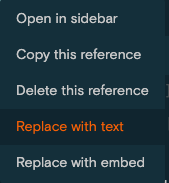

alias:: reference, backlink, backlinks

- [[Blocks]] and [[pages]] can be referenced - use `[[]]` for page references and `(())` for block references.
-
  #+BEGIN_TIP
  When there is a match for your typed text, hover with your mouse over the suggested references to preview (or select via `up/down` arrow). You can also use `shift-enter` (or `shift-click`) to preview in the sidebar.
  #+END_TIP
- `click` on a reference to access it or `shift-click` to open it in the sidebar. This also works for [[search]] results.
-
  #+BEGIN_CAUTION
  When cutting & pasting the _original_ block somewhere else, all block references are going to become _invalid_ - which is a major drawback. This is also true when reindexing _and_ you have removed the `id::` property
  #+END_CAUTION
- **USAGE**
	- When you have a page `smartphone` you can reference it from page `mobile devices` simply by using square brackets - `A [[smartphone]] is a mobile device`.
	- This will create a _[[linked reference]]_ (a _backlink_) on page `smartphone` to page `mobile devices`. Linked references can be found at the bottom of pages.
		- Backlinks are automatically created by Logseq if you reference a [[block]]/[[page]] from another [[block]]/[[page]].
		- Opening a backlink to a page which does not currently exist will _create_ a new page with the backlink text as its title (a file will only be created once the page has at least one block with content)
	- The [[Unlinked References]] list located below [[Linked References]] on a page displays potential backlinks, files which refer to the page but do not have a relevant backlink present.
	- Even if you are not explicitly using square brackets - for example, `A smartphone is a mobile device` - a reference is created - an _[[unlinked reference]]_ which can also be found at the bottom of pages. It displays _potential_ backlinks i.e. items which refer to the page but do not have an explicit backlink present.
	- This allows you to see how your knowledge is connected, and quickly get an overview of a certain topic. Explicitly linked references are also included in your [[graph]].
	- You can *label* references: `[display text]([[page name]])`/`` or `[display text](((block-uuid)))` (note the triple brackets) - see [here](((612a2437-103f-4c3f-bd99-2a98a462b6c2)))
	  id:: 6109937d-d33f-4496-83e5-8469ecc51b54
	- You can `right-click` references to replace them with their text (i.e. copy their content) or embed them. You can also define a [keyboard shortcut](((612a3629-bfa5-4d51-9d6f-fb03237c43fe))).
		- 
- ## Filters
	- Items in the [[Linked References]] section can be filtered.
	- Filters are a simple alternative to [[queries]].
	- **USAGE**
		- By default, all references are shown:
			- You can either _include_ some pages by `clicking` them or _exclude_ certain pages/tags by `shift-clicking` them
			- When _including_ a reference, only blocks will be shown that include this reference, all others will be hidden. You may include multiple references.
			- When _excluding_ a reference, only blocks will be shown that do _not_ include this reference. Blocks that do will be hidden. You may exclude multiple references.
		- Filters are stored as a page-level [[properties]]: `filters:: {"calculator" true, "mobile device" true}`
	- **EXAMPLE**
		- Let's assume you have a page [[mobile devices]]. It has linked references from pages [[smartphone]] (`A smartphone is a [[mobile device]]`), [[smartwatch]] (`A smartwatch is a [[mobile device]] and typically used together with a [[smartphone]]`), [[calculator]] (`A calculator is a [[mobile device]]`).  If you want to see all references for smartphones or smartwatches, but not for calculators, you can exclude it from the mobile devices page