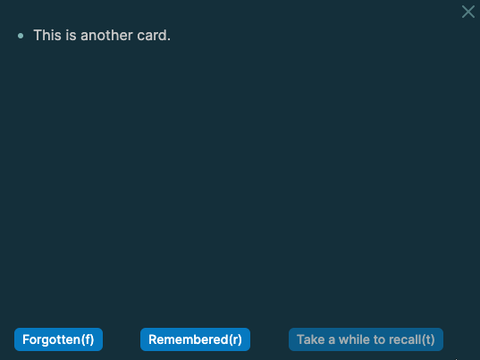

alias:: SRS, cards

-
  > Spaced repetition (SRS) is an evidence-based learning technique that is usually performed with flashcards. It is based on learning over a longer period time with distributed sessions. Newly introduced and more difficult flashcards are shown more frequently, while older and less difficult flashcards are shown less frequently in order to exploit the psychological _spacing effect_.[^1] The use of spaced repetition has been proven to increase rate of learning. [Wikipedia](https://en.wikipedia.org/wiki/Spaced_repetition) 
  collapsed:: true
  [^1]: The spacing effect demonstrates that learning is more effective when study sessions are spaced out. This effect shows that more information is encoded into long-term memory by spaced study sessions
- Flashcards are used in spaced repetition to memorize information via repeated, distributed sessions.
-
  #+BEGIN_TIP
  Logseq uses the SuperMemo 5 ([SM5](https://www.supermemo.com/en/archives1990-2015/english/ol/sm5)) algorithm for their implementation of spaced repetition. The results of your repetitions are stored in the `logseq/srs-of-matrix.edn` file.
  #+END_TIP
- **USAGE**
	- You can create _cards_  (i.e. flashcards) in Logseq. They can be combined with clozes.
		- _Cards_ are question-answer cards.
		- _Clozes_ (cloze item, cloze question, cloze deletion) can be used to generate fill-in-the-blank-forms (German: Lückentexte) for easier learning. They can be used within cards and blocks without cards.
			- _Example:_
			  > Logseq is an (...) application.
			  > [Outliner]
			-
			  #+BEGIN_TIP
			  You can use clozes without cards on any block.
			  #+END_TIP
	- You can group your notes like in a card box - as _remembered_ or _forgotten_.
	- To create a card
	  card-last-score:: 1
	  card-repeats:: 1
	  card-next-schedule:: 2021-08-05T22:00:00.000Z
	  card-last-interval:: -1
	  card-ease-factor:: 2.5
	  card-last-reviewed:: 2021-08-05T19:16:12.436Z
		- add the `#card` tag to any block, or
		- add the [[card]] reference to any block, or
		  card-last-interval:: -1
		  card-repeats:: 1
		  card-ease-factor:: 2.5
		  card-next-schedule:: 2021-08-05T22:00:00.000Z
		  card-last-reviewed:: 2021-08-05T19:26:33.483Z
		  card-last-score:: 1
		- right-click a clock and select _Make a card_ (this will simply add `#card` to the end of your block)
	- To show all cards
		- go to the three dots menu > View Cards, or
		- press `t c`, or
		- use the `/Cards` [[Command]]. You can put the `{{cards }}` statement anywhere on a page where you would like to see all of your cards.
	- To show some of your cards, use a query via `{{cards <query>}}`.
	- To show a specific card, right click the block that has the card reference and select _Preview Card_
	  
	- To create a cloze, use the `/Cloze` [[Command]].
	-
	  #+BEGIN_TIP
	  **Card content**
	  The content of a card can either be a block or a page. To use a page, embed the page in a block you have tagged with `#card` - for example, `{{embed [[myPage]]}}`.
	  #+END_TIP
- **EXAMPLES**
	- This is a card. #card
	  card-last-interval:: -1
	  card-repeats:: 1
	  card-ease-factor:: 2.5
	  card-next-schedule:: 2021-08-05T22:00:00.000Z
	  card-last-reviewed:: 2021-08-05T19:16:16.391Z
	  card-last-score:: 1
	- This is another card. #card
	  card-last-interval:: -1
	  card-repeats:: 1
	  card-ease-factor:: 2.5
	  card-next-schedule:: 2021-08-05T22:00:00.000Z
	  card-last-reviewed:: 2021-08-05T19:26:32.109Z
	  card-last-score:: 1
	- Let's show all of our cards (`{{cards }}`).
		- {{cards }}
			- Summary: 2 items, 2 review counts [[Aug 5th, 2021]]
				- Remembered:   0 (0%)
				- Forgotten :   2 (100%)
	- Let's show all of our cards on this page (`{{cards [[Spaced Repetition]]}}`).
		- {{cards [[Spaced Repetition]]}}
	- Lets add a card with clozes.
		- Clozes are used to {{cloze create fill-in-the-blank}} texts. #card