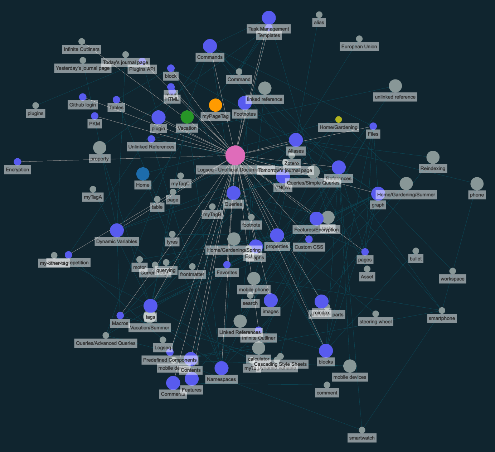

alias:: Graphs, workspace

- _Graphs_ are the representation of all [[blocks]] (bullets) and [[pages]] (which are simply blocks) - i.e. all items of knowledge - and their relationship with each other.
- Items (nodes) of a graph can be [[blocks]], [[pages]] and [[tags]] - again, in effect, all of them are the same. The connection between your items of knowledge allows you generate new insights.
- 
- You can think of a graph as your _workspace_ - you can work with different graphs and switch between them, for example to split work and private knowledge (simply click on the graph name on the top right toolbar). In Logseq, each graph is stored as its own folder that includes settings for Logseq and your content.
- **USAGE**
	-
	  1. You can view the graph for a _single_ page: Open the sidebar and select `Page graph`
	  1. You can view the graph for _all_ of your pages: Click on the three dots on the top right and select `View Graph`
-
  #+BEGIN_TIP
  * You can drag individual nodes for easier overview.
  * You can click on individual nodes to open them.
  * The size of the circles represents the number of backlinks.
  * You can search and filter nodes (not for the page graph) - and even combine multiple filters.
  #+END_TIP